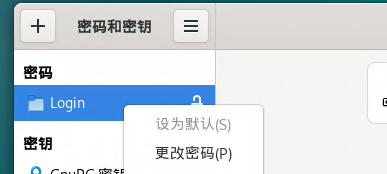

Debian12.5安装Gnome43.0-3

- 安装
```
apt install task-gnome-desktop
```
- 跳过初始化
```
apt autoremove gnome-initial-setup
```
- 允许root登录
```
sed -i '/^\[security\]$/a AllowRoot=true' /etc/gdm3/daemon.conf

echo  "AllowRoot=true">> /etc/gdm3/daemon.conf 
sudo sed -i '/auth required pam_succeed_if.so user != root quiet_success/s/^/#/' /etc/pam.d/gdm-password

sed -i '/auth required pam_succeed_if.so user != root quiet_success/s/^/#/' /etc/pam.d/gdm-autologin

```
- 允许root用户使用远程桌面
```error
就是这两行，通宵查了一晚
```

```
sed -i '/ConditionUser=!root/s/^/#/' /usr/lib/systemd/user/pipewire.socket
sed -i '/ConditionUser=!root/s/^/#/' /usr/lib/systemd/user/pipewire.service
```
- root免密自动登录桌面后，显示密钥链
