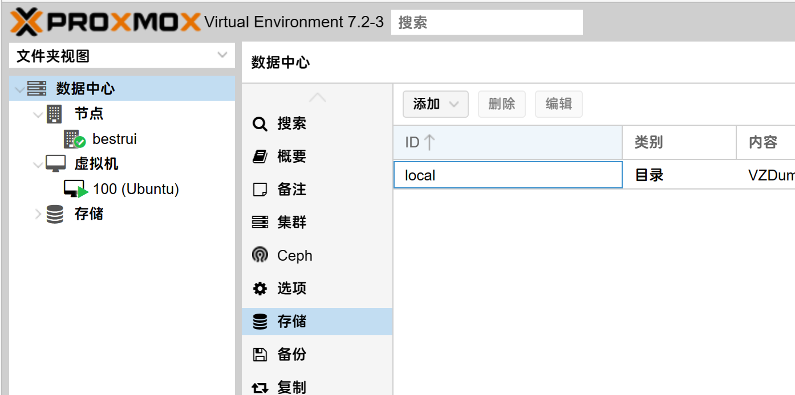

---
# 这是文章的标题
title: 使用前的修改
# 这是页面的图标
icon: play
# 这是侧边栏的顺序
order: 2
---
````warning
我的环境J4125，PVE7.2-3
````
在开始前对系统进行一些本地化修改
## 换源
将系统默认的源换为清华源
#### apt软件源 7.*
将`/etc/apt/sources.list`内容替换为
```config
deb https://mirrors.tuna.tsinghua.edu.cn/debian/ bullseye main contrib non-free
# deb-src https://mirrors.tuna.tsinghua.edu.cn/debian/ bullseye main contrib non-free
deb https://mirrors.tuna.tsinghua.edu.cn/debian/ bullseye-updates main contrib non-free
# deb-src https://mirrors.tuna.tsinghua.edu.cn/debian/ bullseye-updates main contrib non-free
deb https://mirrors.tuna.tsinghua.edu.cn/debian/ bullseye-backports main contrib non-free
# deb-src https://mirrors.tuna.tsinghua.edu.cn/debian/ bullseye-backports main contrib non-free
deb https://mirrors.tuna.tsinghua.edu.cn/debian-security bullseye-security main contrib non-free 
# deb-src https://mirrors.tuna.tsinghua.edu.cn/debian-security bullseye-security main contrib non-free
```
#### PVE软件源
将`/etc/apt/sources.list.d/pve-enterprise.list`替换为
```config
deb https://mirrors.tuna.tsinghua.edu.cn/proxmox/debian bullseye pve-no-subscription
```
#### apt软件源 8.*
`/etc/apt/sources.list`
```
deb https://mirrors.tuna.tsinghua.edu.cn/debian bookworm main contrib
deb https://mirrors.tuna.tsinghua.edu.cn/debian bookworm-updates main contrib
deb https://mirrors.tuna.tsinghua.edu.cn/debian-security/ bookworm-security main contrib

```
`/etc/apt/sources.list.d/ceph.list`
```
deb https://mirrors.tuna.tsinghua.edu.cn/ceph/debian-quincy/ bookworm no-subscription
```
`/etc/apt/sources.list.d/pve-enterprise.list`
```
deb http://download.proxmox.wiki/debian/pve bookworm pve-no-subscription
```

#### lxc软件源
执行下面这句指令
```shell
sed -i 's|http://download.proxmox.com|https://mirrors.tuna.tsinghua.edu.cn/proxmox|g' /usr/share/perl5/PVE/APLInfo.pm
```
## 删除 local-lvm 分区
避免空间浪费，而且 PVE 首页上显示的空间剩余指的是 local 分区，推荐新装 PVE 时进行设置
```shell
lvremove pve/data  
lvextend -l +100%FREE -r pve/root
```
在这里将local-lvm删除    

然后编辑local分区,内容全选    

## 功耗节能
PVE默认的CPU电源策略是性能模式
```bash
# 查看支持的 CPU 电源模式
cat /sys/devices/system/cpu/cpu0/cpufreq/scaling_available_governors

# 查看当前的 CPU 电源模式
cat /sys/devices/system/cpu/cpu0/cpufreq/scaling_governor

```

几种电源模式的解释说明：

| 电源模式     | 解释说明                                                     |
| :----------- | :----------------------------------------------------------- |
| performance  | 性能模式，将 CPU 频率固定工作在其支持的较高运行频率上，而不动态调节。 |
| userspace    | 系统将变频策略的决策权交给了用户态应用程序，较为灵活。       |
| powersave    | 省电模式，CPU 会固定工作在其支持的最低运行频率上。           |
| ondemand     | 按需快速动态调整 CPU 频率，没有负载的时候就运行在低频，有负载就高频运行。 |
| conservative | 与 ondemand 不同，平滑地调整 CPU 频率，频率的升降是渐变式的，稍微缓和一点。 |
| schedutil    | 负载变化回调机制，后面新引入的机制，通过触发 schedutil `sugov_update` 进行调频动作。 |
### 调整 CPU 模式
首先得安装 cpupower：
```
apt install linux-cpupower
```
下面是 cpupower 的一些常用命令：
```bash
# CPU实时频率查看
watch -n 1 cpupower monitor

# 查看当前所有CPU的信息
cpupower -c all frequency-info

# 设置所有CPU为节能模式
cpupower -c all frequency-set -g powersave

# 设置所有CPU为性能模式
cpupower -c all frequency-set -g performance
```
设置为系统服务
`/usr/lib/systemd/system/cpupowersave.service`
```
[Unit]
Description=Configure CPU power related settings
After=syslog.target

[Service]
Type=oneshot
RemainAfterExit=yes
ExecStart=/usr/bin/cpupower -c all frequency-set -g powersave
ExecStop=/usr/bin/cpupower -c all frequency-set -g performance

[Install]
WantedBy=multi-user.target
```
命令
```
重新加载
systemctl daemon-reload
开机自动启动
systemctl enable cpupowersave
当前启动
systemctl start cpupowersave
```