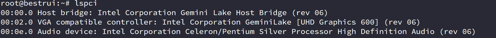
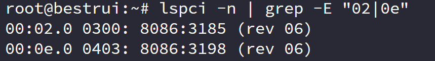
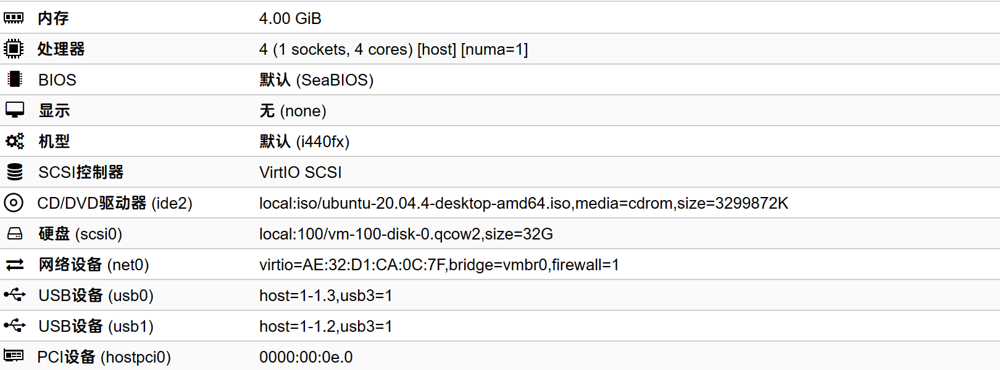

---
# 这是文章的标题
title: ubuntu显卡直通
# 这是页面的图标
icon: page
---
````warning
我的环境J4125，PVE7.2-3
````

## 修改BIOS
打开VT-D    
开启CSM    
CSM选项中的项目都选为legacy    
## PVE设置
#### 启动内核IOMMU支持
修改` /etc/default/grub`中的`GRUB_CMDLINE_LINUX_DEFAULT`为：
```config
GRUB_CMDLINE_LINUX_DEFAULT="quiet intel_iommu=on i915.enable_gvt=1 iommu=pt video=efifb:off video=vesafb:off"
```
#### 加载硬件直通相关模块
修改`/etc/modules`，添加以下内容
```config
vfio
vfio_iommu_type1
vfio_pci
vfio_virqfd
kvmgt
```
修改`/etc/modprobe.d/pve-blacklist.conf`，添加以下内容
```config
blacklist snd_hda_intel
blacklist snd_hda_codec_hdmi
blacklist snd_hda_codec
blacklist snd_hda_core
blacklist i915
```
#### 更新配置信息
执行以下命令
```shell
update-grub
update-initramfs -u -k all
reboot
```
#### 绑定核显到vfio模块
查看核显以及声卡的ID：    


根据ID修改下面的命令
```shell
echo "options vfio-pci ids=8086:3185,8086:3198" > /etc/modprobe.d/vfio.conf
```
#### 创建虚拟机

#### 修改配置文件
修改`/etc/pve/nodes/bestrui/qemu-server/100.conf`将100改为VM ID
我的配置文件，主要是第一行和第二行
```config
args: -device vfio-pci,host=00:02.0,addr=0x02,x-igd-gms=1
vga: none
boot: order=scsi0
cores: 4
cpu: host
hostpci0: 0000:00:0e.0
ide2: local:iso/ubuntu-20.04.4-desktop-amd64.iso,media=cdrom,size=3299872K
machine: q35
memory: 4096
meta: creation-qemu=6.2.0,ctime=1675316539
name: Ubuntu
net0: virtio=AE:32:D1:CA:0C:7F,bridge=vmbr0,firewall=1
numa: 1
ostype: l26
scsi0: local:100/vm-100-disk-0.qcow2,size=32G
scsihw: virtio-scsi-pci
smbios1: uuid=46ee4016-cf84-4b0a-a256-9704c69fdf73
sockets: 1
usb0: host=1-1.3,usb3=1
usb1: host=1-1.2,usb3=1
vmgenid: 3dbb9f0f-4c44-4509-a436-b41c92e15b16
```