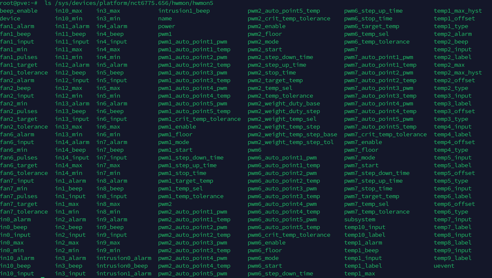

---
# 这是文章的标题
title: 控制PWM风扇转速
# 这是页面的图标
icon: page
---
## PWM模块
首先查看有没有PWM模块
```bash
ls /sys/class/hwmon/hwmon*/
```
如果没有先安装
```bash
echo nct6775 >> /etc/modules
modprobe -v nct6775
```
安装完以后在`/sys/devices/platform`目录下应该会有`nct6775*`目录
```
ls /sys/devices/platform | grep nct6775
```

我们看看这个目录里都有啥

```
 ls /sys/devices/platform/nct6775.656
```
`hwmon`咱们只看这个,别的不管
> hwmon即hardware monitoring framework，硬件监视框架，包括温度传感器、风扇、电源等器件驱动的框架       
我们在看看这个目录里都有啥

```
 ls /sys/devices/platform/nct6775.656/hwmon
```
咱们继续看
```
ls /sys/devices/platform/nct6775.656/hwmon/hwmon5
```

现在就能看到控制风扇相关的文件了

| 文件名称     | 作用           | 
| ---         | ---            | 
| `fan_input`  | 风扇当前转速    |
| `pwm_enable` | 是否启用pwm控制 | 
| `pwm`       | pwm的值0-255    |

## 模式切换

````danger
首先先查看当前模式，我这里的值为`5`，是BIOS在控制风扇转速
````

```bash
#目录替换为自己的    
cat /sys/devices/platform/nct6775.656/hwmon/hwmon5/pwm2_enable
```    
改为`1`，我们手动控制
```bash
echo 1  > /sys/devices/platform/nct6775.656/hwmon/hwmon5/pwm2_enable
```
改为`5`，改回BIOS控制
```bash
# 这里的值替换为自己刚才的值
echo 5  > /sys/devices/platform/nct6775.656/hwmon/hwmon5/pwm2_enable
```
## 转速控制
```bash
#将RPM替换为0~255区间
#路径也替换为自己设备的
echo RPM  > /sys/devices/platform/nct6775.656/hwmon/hwmon5/pwm2
```
## 转速查看
```bash
cat /sys/devices/platform/nct6775.656/hwmon/hwmon5/fan2_input
```