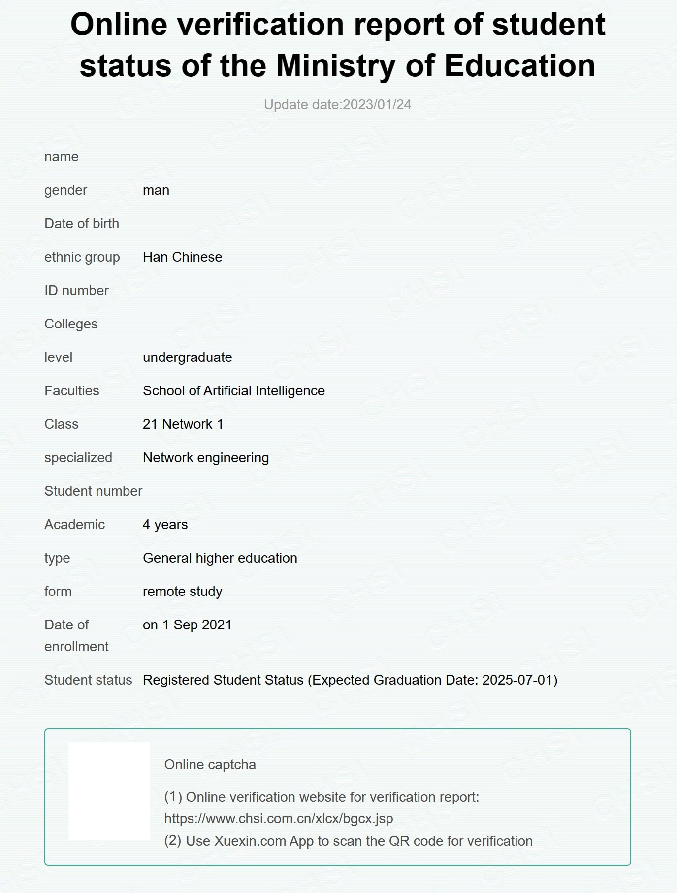
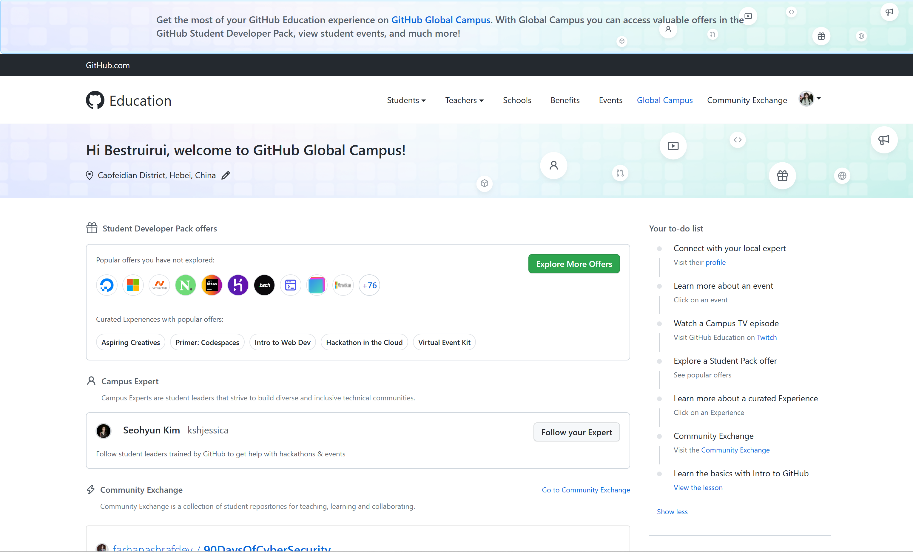

---
# 这是文章的标题
title: 申请学生包
# 这是页面的图标
icon: school
# 设置写作时间
date: 2023-01-25
---
```info
2024年01月04日 更新      
```
## 开始
### 准备材料
- 学信网证明（英文）
- 一台电脑
- 科学的网络环境
- 自己学校的教育邮箱
### 申请过程
1. 先准备一个学信网的证明[学信档案 ](https://my.chsi.com.cn/archive/bab/index.action)
2. 在查看页面使用浏览器直接翻译成英语
3. 截图
4. 完善[Payment Information](https://github.com/settings/billing/payment_information)
5. win11设置>隐私和安全性>位置>默认位置，把默认位置改为自己学校位置，同时给浏览器位置权限
6. 打开[GitHub benefits](https://education.github.com/discount_requests/pack_application)
````danger
不要用代理！
````
7. 邮箱填自己的教育邮箱，学校填自己的，如何使用Github可以参考我的
>I hope to get the student certification of Github, because your organization's certification is more authoritative, which is convenient for other development certification. At the same time, I also want to learn more project knowledge on github and use it. I can also upload my code to the library for sharing. The main purpose is to learn and use this student certification. I hope github will give certification. Thank you.
8. 上传你准备好的材料，这里直接把刚才截图的照片拖过去就行
````tip
这里图片上传不过去可以把`github-education-web.s3.amazonaws.com`这个域名代理，注意，是只代理这一个域名！
````
9. 提交
10. 等待学生权益到账，快的话隔天，慢的话一周

