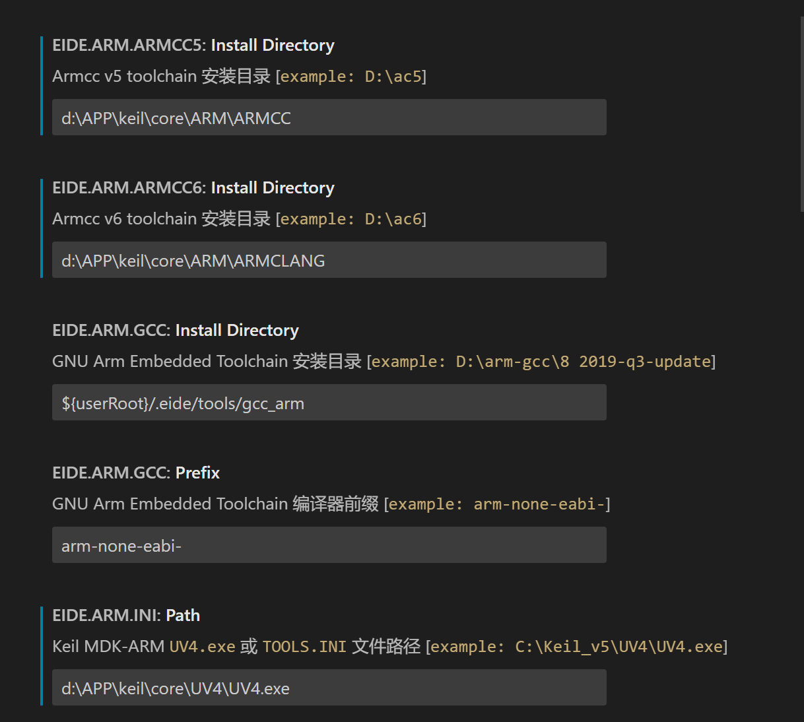
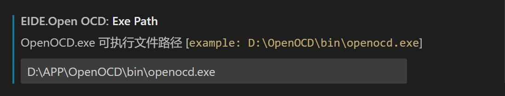
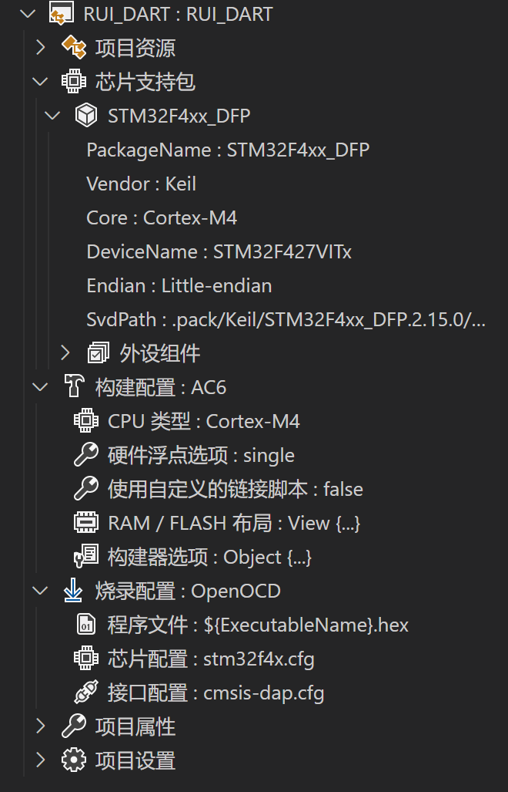

---
# 这是文章的标题
title: 使用Vscode开发
# 这是页面的图标
icon: code
---
````tip
在开始之前先检查一下`C:\Users`下的用户名是否含有特殊字符，是否是汉语，否则无法正常使用
````
## 1.安装插件
- [Embedded IDE](https://marketplace.visualstudio.com/items?itemName=CL.eide)
- [Cortex-Debug](https://marketplace.visualstudio.com/items?itemName=marus25.cortex-debug))
- [C/C++](https://marketplace.visualstudio.com/items?itemName=ms-vscode.cpptools)
## 2.插件配置
#### Embedded IDE - 导入工程，编译，下载
##### 插件的基础配置，我截图的这几个是需要配置的

因为我使用的是`CMSIS-DAP`调试器，所以这里的`OpenOCD`需要配置
OpenOCD可以在这里[下载](https://download.bestrui.top/%E8%BD%AF%E4%BB%B6/windows/openocd-20230202.7z)

##### 导入工程后的配置：
- 点击`芯片支持包`选项右边的`＋`选择`From Repo`
- 直接搜索`stm32`选择开发板的型号
- 导入完成后接着选择开发板的具体型号
- `构建配置`根据自己的项目选择
- `烧录配置`如果你也和我一样使用的是`CMSIS-DAP`调试器，那这里选择`OpenOCD`，子选项根据自己工程配置
这是我配置成功的截图

#### Cortex-Debug - 代码调试
在家里没有可以用的设备，暂时先不写
#### C/C++ - 跳转定义
