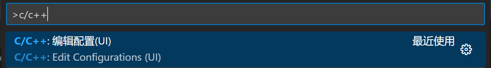
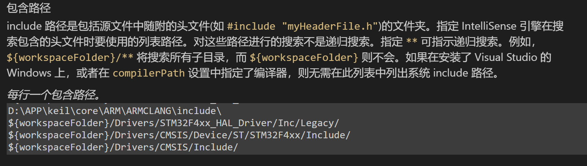

---
# 这是文章的标题
title: 使用VS Code开发stm32
# 这是页面的图标
icon: code
---
````tip
在开始之前先检查一下`C:\Users`下的用户名不能含有特殊字符，汉语，否则无法正常编译
````
## 1.安装插件
- [Embedded IDE](https://marketplace.visualstudio.com/items?itemName=CL.eide)
- [Cortex-Debug](https://marketplace.visualstudio.com/items?itemName=marus25.cortex-debug)
- [C/C++](https://marketplace.visualstudio.com/items?itemName=ms-vscode.cpptools)
- [GitHub Copilot](https://marketplace.visualstudio.com/items?itemName=GitHub.copilot)
## 2.插件配置
### Embedded IDE -- 导入工程，编译，下载
#### 插件的基础配置
我截图的这几个是需要配置的

我使用的是`CMSIS-DAP`调试器，这里的`PATH`也需要配置一下    
OpenOCD可以在这里[下载](https://download.bestrui.top/%E8%BD%AF%E4%BB%B6/windows/openocd-20230202.7z)    

#### 导入工程后的配置：
- 点击`芯片支持包`选项右边的`＋`选择`From Repo`
- 直接搜索`stm32`选择开发板的型号
- 导入完成后接着选择开发板的具体型号
- `构建配置`根据自己的项目选择
- `烧录配置`如果你也和我一样使用的是`CMSIS-DAP`调试器，那这里选择`OpenOCD`，子选项根据自己工程配置      
这是我配置成功的截图   

### Cortex-Debug -- 代码调试
在家里没有可以用的设备，暂时先不写   
### C/C++ -- 跳转定义
命令面板搜索`C/C++`选择`编辑配置(UI)`   


配置`包含路径`   


```
//引用instdint.h报错
D:\APP\keil\core\ARM\ARMCLANG\include\

//引用头文件报错
${workspaceFolder}/**
${workspaceFolder}/Core/Inc/
${workspaceFolder}/Drivers/STM32F4xx_HAL_Driver/Inc/
${workspaceFolder}/Drivers/STM32F4xx_HAL_Driver/Inc/Legacy/
${workspaceFolder}/Drivers/CMSIS/Device/ST/STM32F4xx/Include/
${workspaceFolder}/Drivers/CMSIS/Include/
```
### GitHub Copilot  -- AI补全
**Copilot**是GitHub和OpenAI合作开发的一个人工智能工具，可以通过GitHub Copilot自动补全代码     
正式版定价10美元/月，但是学生免费✌️     
关于如何申请Github的学生包可以参考[这里](../../Other/Github/student.md)