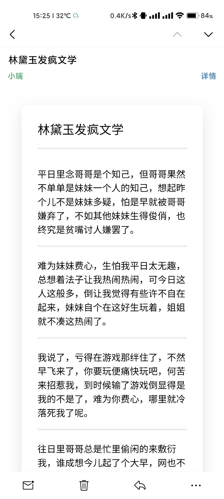

---
# 这是文章的标题
title: 邮件模板
# 这是页面的图标
icon: envelope
# 这是侧边栏的顺序
order: 1
---



```html
<!DOCTYPE html>

<html lang="en">
	<head>
	    <style>
	        .content {
	            box-shadow: 0 10px 30px rgb(0 0 0 / 10%);
	            padding: 31px;
	            background: white;
	            border-radius: 10px;
	            margin: 26px;
	            margin-top: 20px;
	            margin-bottom: 21px;
	        }
	        p {
	            border-bottom: 3px solid #eaecef;
	            padding-bottom: 1rem;
	        }
	         @media screen and (min-width: 1000px) {
	            .content {
	                padding: 53px;
	                margin-left: 30%;
	                margin-right: 30%;
	            }
	        }
	    </style>
	</head>
	<body>
	    <div class="content">
	        <p class="title" style="margin: 0; margin-bottom: 36px;  font-size: 24px; font-weight: 600; color: #000000;">
	            林黛玉发疯文学
	        </p>
	        <p class="text" style="margin: 0; margin-bottom: 24px;">
	            平日里念哥哥是个知己，但哥哥果然不单单是妹妹一个人的知己，想起昨个儿不是妹妹多疑，怕是早就被哥哥嫌弃了，不如其他妹妹生得俊俏，也终究是贫嘴讨人嫌罢了。
	        </p>
	        <p class="text" style="margin: 0; margin-bottom: 24px;">
	            难为妹妹费心，生怕我平日太无趣，总想着法子让我热闹热闹，可今日这人这般多，倒让我觉得有些许不自在起来，妹妹自个在这好生玩着，姐姐就不凑这热闹了。
	        </p>
	        <p class="text" style="margin: 0; margin-bottom: 24px;">
	            我说了，亏得在游戏那绊住了，不然早飞来了，你要玩便痛快玩吧，何苦来招惹我，到时候输了游戏倒显得是我的不是了，难为你费心，哪里就冷落死我了呢。
	        </p>
	        <p class="text" style="margin: 0; margin-bottom: 24px;">
	            往日里哥哥总是忙里偷闲的来敷衍我，谁成想今儿起了个大早，网也不上了，球也不打了，巴巴的凑了过来，谁知道是不是看多了别的妹妹，心里发虚呢。
	        </p>
	    </div>
	</body>
</html>
```